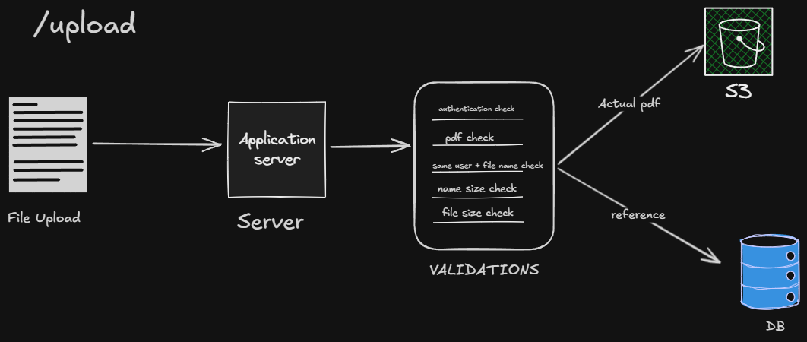
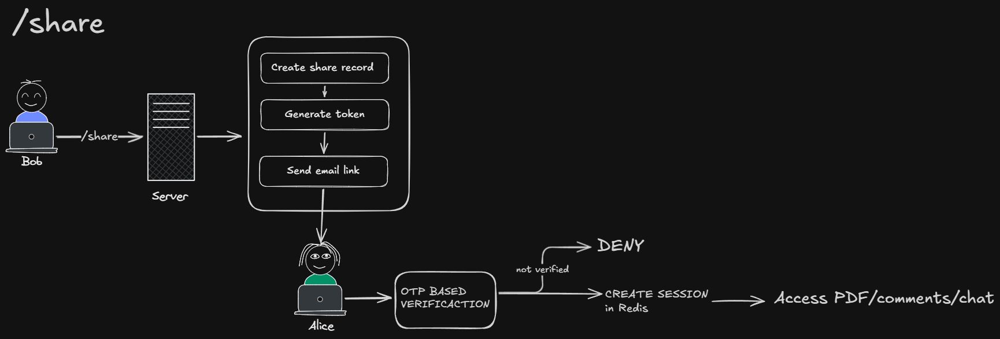
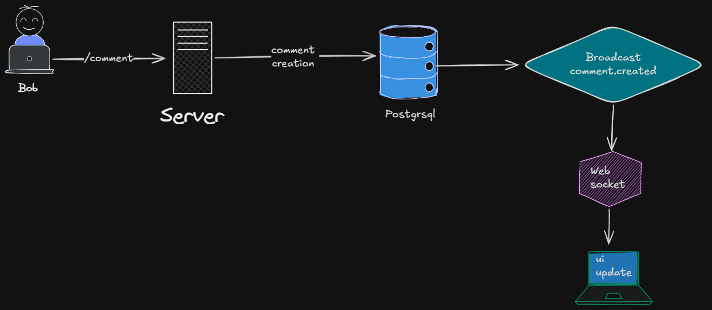
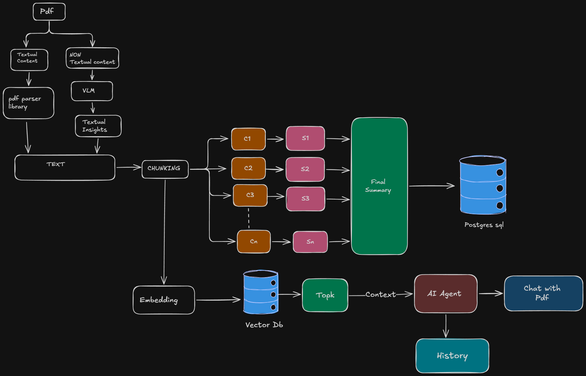

# Engineering decisions

These decisions are recorded against the current implementation and the hand-drawn flow artifacts in `docs/artifacts/`. The diagrams are useful design notes; the code is the source of truth where the two differ.

## Artifacts reviewed

### Upload flow



`upload.png` shows upload validation, S3 storage, and database metadata.

### Share flow



`share.png` shows owner-created share links, email delivery, OTP verification, Redis sessions, and guest access.

### Comment flow



`comment.png` shows comment persistence followed by a `comment.created` broadcast over WebSockets.

### AI summary and chat flow



`AI_summary_and_Chats.png` shows PDF extraction, visual fallback, chunking, summaries, embeddings, vector retrieval, chat context, and history.

## 1. Store PDFs in private S3

PDF files belong in S3, not in PostgreSQL. PostgreSQL keeps the document record, filename, size, MIME type, and S3 object key. The API checks access before streaming the object to the browser.

This keeps large binary data out of the relational database and keeps the storage bucket behind the API's authorization boundary. The upload artifact shows the intended split clearly: the actual PDF goes to S3 and a reference goes to the database.

The implementation is in:

- `api/src/storage/s3.service.ts`
- `api/src/services/document.service.ts`
- `api/src/controllers/document.controller.ts`

The bucket is configured through `AWS_REGION`, `AWS_ACCESS_KEY_ID`, `AWS_SECRET_ACCESS_KEY`, and `AWS_S3_BUCKET`. Uploaded objects use server-side AES-256 encryption. Document cleanup deletes the S3 object and then the database record.

## 2. Use WebSockets for comments

Comments are written through REST and then broadcast through a document-scoped WebSocket. REST remains the durable source of truth. WebSockets remove the need for every open workspace to poll for new comments.

The comment artifact shows the flow from `/comment` to PostgreSQL, then to a `comment.created` broadcast and finally to the connected UI. The implementation follows that shape:

1. `comment.service.ts` authorizes and persists the comment.
2. `comment-connection.manager.ts` finds sockets connected to that document.
3. The manager sends a `comment.created` event to each open socket.
4. `useComments.ts` inserts the event into the local threaded comment tree.

The current connection manager is in process memory. If the API runs as multiple instances later, comment events will need shared delivery or connection affinity.

## 3. Keep the AI architecture behind the API

The browser should not call model providers directly. The API owns PDF extraction, visual analysis, chunking, embeddings, retrieval, summaries, chat prompts, provider fallback, and conversation persistence.

The AI artifact shows the main path:

```text
PDF
  -> text extraction or visual fallback
  -> unified text
  -> chunks
  -> chunk summaries and final summary
  -> embeddings and vector storage
  -> top-k retrieval
  -> context for the AI assistant
  -> chat response and history
```

The code implements this through the following boundaries:

- `api/src/ai/loaders/` extracts text and analyzes pages that need visual fallback.
- `api/src/ai/splitters/` creates page-aware chunks.
- `api/src/ai/models/` creates Gemini and OpenAI model clients.
- `api/src/ai/retrieval/` queries document-scoped pgvector embeddings.
- `api/src/ai/context/` builds grounded prompts and limits conversation history.
- `api/src/services/summary.service.ts` persists document summaries.
- `api/src/services/chat.service.ts` prepares, streams, and persists chat turns.

This boundary also keeps provider credentials server-side and lets document authorization happen before retrieval or generation.

## 4. Stream chat to the browser with SSE

LangChain chat models expose an async stream interface. The API can consume that stream and pass the result to the browser as Server-Sent Events without adding another streaming service or protocol.

The current flow is:

```text
LangChain model stream
  -> chat service async generator
  -> Hono SSE response
  -> browser fetch stream parser
  -> assistant message in the workspace
```

The API sends these event types:

- `message.start`, including the conversation ID;
- `message.token`, containing generated content;
- `message.complete`, containing the completed response;
- `message.error`, when generation fails.

The primary chat model is OpenAI when configured. Gemini is the fallback. The fallback is used only when the primary model fails before it emits content, so the client does not receive two partially combined answers.

Relevant implementation files are:

- `api/src/services/chat.service.ts`
- `api/src/controllers/chat.controller.ts`
- `web/src/services/chatApi.ts`
- `web/src/pages/SharedDocumentPage.tsx`

## 5. Guests cannot share documents

A guest session is created for one invited share and one document. Guests can access the PDF, chat with it, and create comments according to the current guest permissions. They cannot create, list, or revoke share links.

Only an authenticated document owner can use the share-management endpoints. This keeps control of the document's audience with the owner and prevents a guest from extending access to another person.

The share artifact shows the intended flow:

```text
Owner creates share
  -> token is generated and stored as a hash
  -> invitation email is sent
  -> invited guest verifies the email with an OTP
  -> Redis guest session is created
  -> guest accesses the PDF, comments, and chat
```

An unverified guest is denied. The share token expires after seven days, and a verified guest session lasts for up to 24 hours, subject to the share expiry. The guest session is stored in Redis and is checked by the shared document authorization path.

Relevant implementation files are:

- `api/src/services/share.service.ts`
- `api/src/controllers/share.controller.ts`
- `api/src/routes/shares.ts`
- `api/src/middleware/auth.ts`

The owner-only boundary is enforced on `POST`, `GET`, and `DELETE` share-management routes with `requireAuth`, and the service checks that the authenticated user owns the document.
